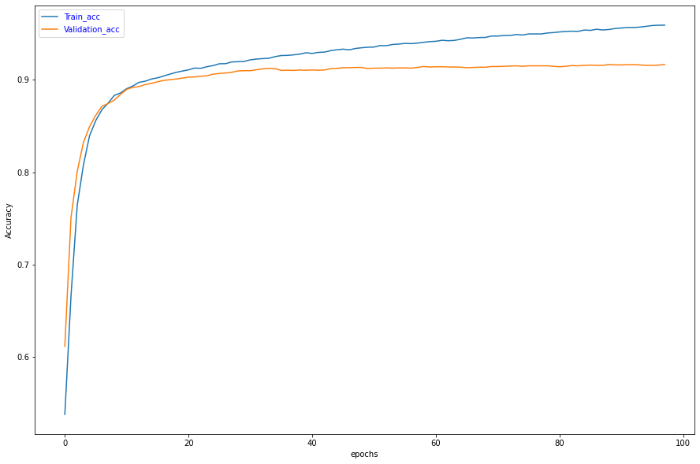
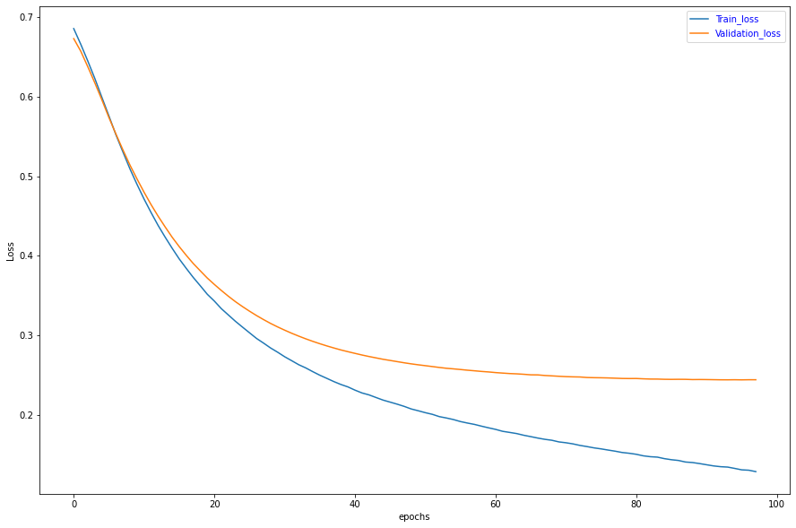
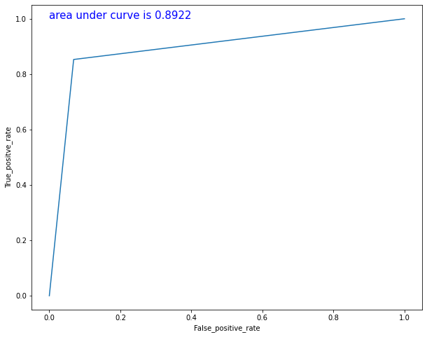
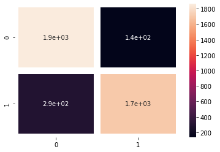
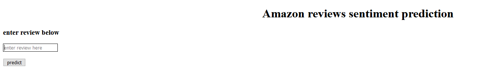
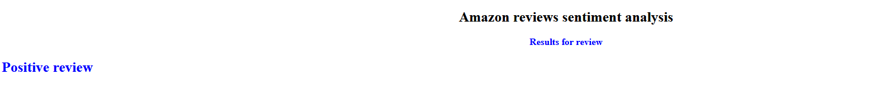
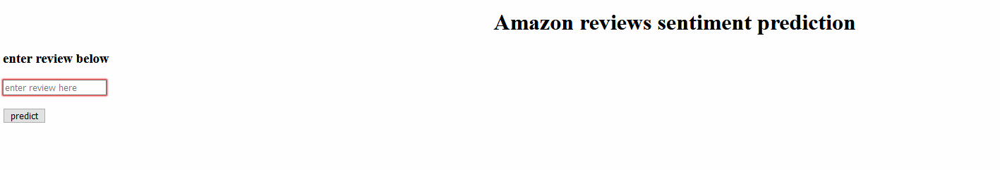

# Amazon cell phone review sentiment analysis

# Table of contents
1. [Introduction](#introduction)
2. [What is NLP](#Dash)
3. [Project Overview](#Overview)
4. [Requirements](#req)
5. [Model](#model)
5. [Demo](#Demo)
6. [Tools Used](#tools)


## Introduction <a name="introduction"></a>
 This is a NLP project with a objective to understand the sentiment behind the cell phone review on amazon.


## What is NLP ? <a name="Dash"></a>


Natural language processing (NLP) is a method to translate between computer and human languages. It is a method of getting a computer to understandably read a line of text without the computer being fed some sort of clue or calculation. In other words, NLP automates the translation process between computers and humans. [source](https://www.techopedia.com/definition/653/natural-language-processing-nlp)


## Overview<a name  = "Overview"></a>
This project is sentiment analysis project. As the name suggests, sentiment analysis is used to identify the sentiments among several cell phone reviews on amazon. It is also used to identify the sentiment where the emotions are not expressed explicitly. Companies are using sentiment analysis, an application of natural language processing (NLP) to identify the opinion and sentiment of their customers online. It will help companies to understand what their customers think about the products and services. Companies can judge their overall reputation from customer posts with the help of sentiment analysis. In this way, we can say that beyond determining simple polarity, sentiment analysis understands sentiments in context to help us better understand what is behind the expressed opinion.


## requirements<a name  = "req"></a>
Project runs on [Python 3.6.1](https://www.python.org/downloads/release/python-361/ "Download Python 3.6.1")  
and all requiremets can be installed by following command you can find requirement.txt [here](https://github.com/SampathHN/Stock_screaner_dash/blob/master/requirements.txt "requirements.txt")
#### installing requried modules
```python
pip install -r requirements.txt
```
#### downloading nltk 
```python
import nltk
nltk.download()
````

## Model<a name  = "model"></a>  
#### Optimizer
```python
adm = tf.keras.optimizers.Adam(lr=1e-6,decay=1e-3)
```

#### Tensorflow early stop callback 
````python
loss_moniter = tf.keras.callbacks.EarlyStopping(monitor='val_loss', min_delta=0.0001, patience=5, verbose=1, mode='auto',baseline=None, restore_best_weights=False)
````
#### Model summary


#### Accuracy VS epochs



####  Loss VS epochs



#### ROC



#### Confusion matrix



#### model can be downloaded from here [model.h5](https://drive.google.com/file/d/1pmT2Udil-BIFNH1z2HD4beTACx2zjMNQ/view?usp=sharing "Trained model")


## Demo<a name  = "Demo"></a>
#### Input 



#### Output



#### Example




### to run the app clone the repo and run app.py


## Tools used <a name="tools"></a>


<table>
  <tr>
    <td></td>
     <td></td>
     <td></td>
  </tr>
  <tr>
    <td></td>
    <td></td>
    
  </tr>
 </table>


 ## Credits  
Data was downloaded from [Kaggle](https://www.kaggle.com/grikomsn/amazon-cell-phones-reviews "Amazon Cell Phones Reviews")  

